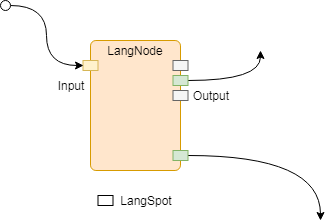
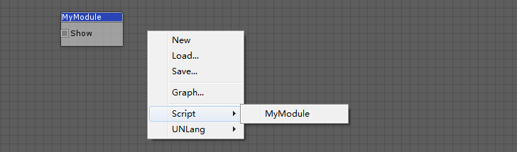

UNLang Node (`LangNode`) is the fundamental object. All visualized node of UNLang should be inherit from UNLang Node.

## What's `LangNode`

`LangNode` is just like an electronic component with `input`/`output` pins. The signal triggers the `input` pin, then the whole `LangNode` is running. While the `LangNode` runs or terminate, it could trigger the signals to the `output` pins.



## LangSpot

`LangSpot` is the node `pin`. A customized module should define how many `input` or `output` LangSpots. Then UNLang could visualize the module in editor and standard the operations on the module.

```csharp
public sealed class LangSpot
{
    public LangSpot(string name, LangType.Category category, Node owner, int capacity, SpotType type);
}
```

|Parameter|Description|
|--:|:--|
|`name`|`LangSpot` name.|
|`category`|The connection value type. Details please check `LangType.Category`.|
|`owner`|The `LangSpot` owner, it always be `this`.|
|`capacity`|How many connections to the `LangSpot` at the same time.|
|`type`|The `LangSpot` type. It could be `In` (**Input**) or `Out` (**Output**).|

## NodeInterface

Using `NodeInterface` attribute, user could define the visual result of a module in UNLang editor.

> **NOTE**: `NodeInterface` is a required option for a module.

## Implement Your Module

`LangNode` and `LangSpot` standard the basic component and operation for a module.

Let's implement a basic module in UNLang by using UnityEngine.Debug to show a constant string `Hello UNLang!`.

```csharp
[NodeInterface("MyModule", "Script/")]
public sealed class MyModule : LangNode
{
    public override void Init()
    {
        Add(new LangSpot("Show", LangType.Category.Any, this, -1, SpotType.In));
    }

    public override void OnSignal(Spot spot, params object[] args)
    {
        if (SpotType.In == spot.Type)
        {
            UnityEngine.Debug.Log("Hello UNLang!");
        }
    }
}
```

What the user need to do is:

* Firstly, override `Init` method to define the `LangSpot` of the module.
  > Example code define one `LangSpot`. `Show` is the `LangSpot` name; `Any` means the LangSpot could connect any type value from the up-stream; `this` is the owner of the `LangSpot`; `-1` means it could be connected with any count lines at the same time; `In` means it's an input spot.
* Secondly, handle the logic in `OnSignal` method.
  > Example code check if the spot type is `In`, then print `Hello UNLang!` string in console window.
* Finally, use `NodeInterface` attribute to define the module name and category in UNLang editor.
  > Example code define the module name is `MyModule` and it is under `Script` menu.

The following snapshot is `MyModule` in UNLang editor:


