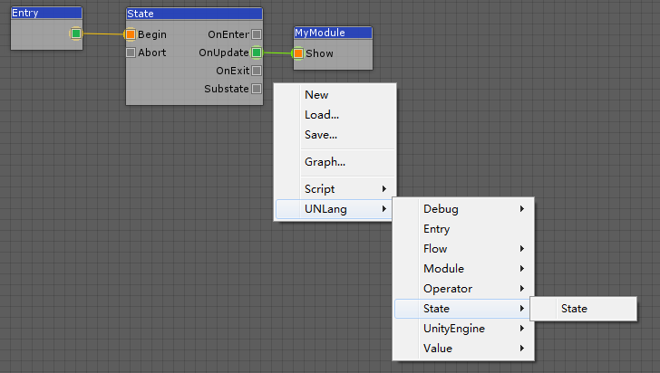
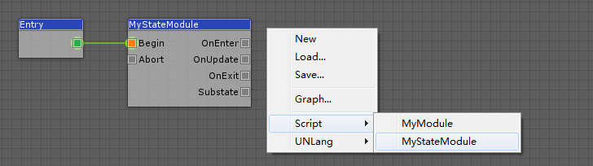

**UNLang State** is a `state` type of state machine, since state machine is a common way to handle a game logic. Using `state`, user could implement loop logic during a certain time only if the `state` is not exit.

Of cause, user could implement basic `state` of their own by override `LangNode`, but UNLang has provided buildin one for user to customize.

## State

UNLang `State` provides some default `LangSpot`.

|Spot|Description|
|--:|:--|
|`Begin`|The `state` entrance.|
|`Abort`|Force to exit the `state`.|
|`OnEnter`|The `state` initialize trigger.|
|`OnUpdate`|The `state` frame tick trigger.|
|`OnExit`|The `state` terminate trigger.|
|`Substate`|Child state of the `state`.|

## How to Use State

There are two ways to use UNLang state.

> Let's use `state` to print `Hello UNLang!` per frame.

### User State to trigger other module

Use UNLang `State` directly and drive other logic.



Use `OnUpdate` output spot to trigger `MyModule` created in UNLang Node section since `OnUpdate` will be triggered per frame.

### Extend State

Implement `MyStateModule` to do the same thing.

```csharp
using UNLang;
using UNode;

[NodeInterface("MyStateModule", "Script/")]
public sealed class MyStateModule : State
{
    protected override void OnExecute(LangInstance instance)
    {
        UnityEngine.Debug.Log("Hello UNLang!");
    }
}
```

Override `OnExecute` protected method to print the constant string.



### Difference

The big difference between the two options is Whether the logic could be controlled in UNLang. If user wants to control the logic in UNLang, exporting the logic module and use fundamental modules to compose; Or implement the full feature internally and trigger it by UNLang.

Which way to use is mainly based on the complexity and reuse of the logic, and fully decided by user.
