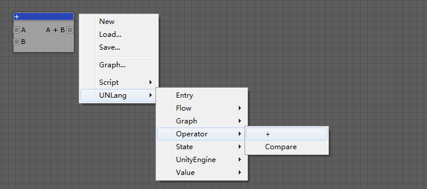
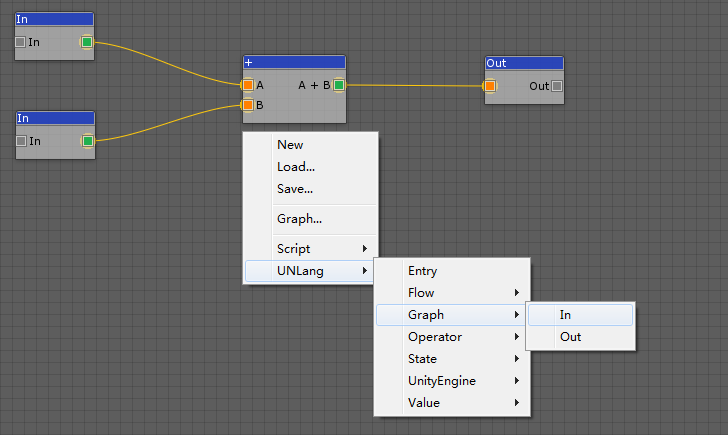
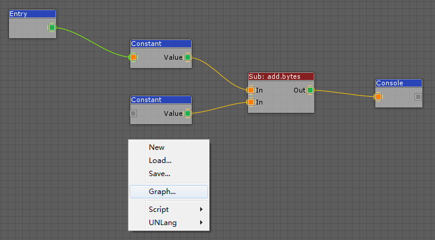

**UNLang Graph**可以将UNLang脚本打包成一个独立的模块，并被其他脚本重用。是UNLang抽象脚本并提供的一种更高层的重用机制。

使用者需要做的关键步骤是需要在UNLang脚本中连接`In`和`Out`模组来定义`Graph`的输入参数和输出结果。

## 输入值

一个`Graph`应该定义输入值，这样UNLang就可以理解`Graph`的入口，并知道如何连接其他模组。就类似于函数的输入参数。

> 使用`UNLang/Graph/In`模块。

## 返回值

一个`Graph`如果存在返回值也可以定义输出结果。

> 使用`UNLang/Graph/Out`模块。

## 例子

我们来制作一个计算器的整数加法（a + b = c）功能。

### 创建`add` Graph

#### ① 创建"+"模块

* 如下图，使用`UNLang/Operator/+`模块。
  
* 在`Inspector`窗口中设置`+`模块值类型为`Integer`。

#### ② 连接"In"和"Out"模块

* 添加`UNLang/Graph/In`和`UNLang/Graph/Out`模组。
* 在`Inspector`窗口中设置`In`和`Out`模块的值类型是`Integer`。
* 如下图连接。
  

#### ③ 存储到`add.bytes`文件

### 使用`add` Graph

* 通过`Graph...`菜单并选择`add.bytes`文件来导入`add` Graph。
* 如下图设置脚本：两个常量值，和打印到console窗口。
* 使用`Entry`模块作为脚本入口。
  

## 总结

`Graph`将隐藏所有细节的模组，而只显示脚本的`In`和`Out`管脚。因此`Graph`是UNLang抽象复杂脚本并使其可以被其他脚本重用的一种较好的方式。
