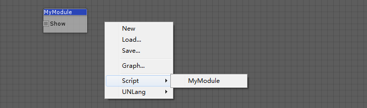

UNLang节点（`LangNode`）是基础对象。UNLang所有可视化节点都需要继承自UNLang节点。

## 什么是`LangNode`

`LangNode`就像一个带有`输入`/`输出`的电子元件。信号触发`输入`管脚，然后整个`LangNode`开始运行。在`LangNode`运行中或者结束时，可以触发`输出`管脚信号。


## LangSpot

`LangSpot`是节点的`管脚`。 一个自定义模块应该定义有多少个`输入`或者`输出` 管脚. 这样UNLang就可以在编辑器中可视化显示这个模块，并标准化模块的操作。

```csharp
public sealed class LangSpot
{
    public LangSpot(string name, LangType.Category category, Node owner, int capacity, SpotType type);
}
```

|参数|描述|
|--:|:--|
|`name`|`LangSpot`名字。|
|`category`|连接类型。详细请查看`LangType.Category`。|
|`owner`|`LangSpot`所有者，一般都是`this`。|
|`capacity`|这个`LangSpot`同时能连接的最多数量连线。|
|`type`|`LangSpot`类型。它可以是`In`（**输入**）或者`Out`（**输出**）。|

## NodeInterface

使用`NodeInterface`属性，使用者可以定义模块在UNLang编辑器中的可视化结果。

> **注意**: `NodeInterface`是一个模块的必选项。

## 实现你的模块

`LangNode`和`LangSpot`标准化了一个模块的基本组件和操作。

让我们用UnityEngine.Debug在UNLang中实现一个基础模块，用来显示一个字符串`Hello UNLang!`。

```csharp
[NodeInterface("MyModule", "Script/")]
public sealed class MyModule : LangNode
{
    public override void Init()
    {
        Add(new LangSpot("Show", LangType.Category.Any, this, -1, SpotType.In));
    }

    public override void OnSignal(Spot spot, params object[] args)
    {
        if (SpotType.In == spot.Type)
        {
            UnityEngine.Debug.Log("Hello UNLang!");
        }
    }
}
```

使用者需要做：

* 首先，重写`Init`方法来定义这个模块的`LangSpot`。
  > 例子代码定义了一个`LangSpot`。`Show`是这个`LangSpot`的名字；`Any` 意味着这个LangSpot可以连接上游输入的任何类型数据信号；`this`是这个`LangSpot`的宿主；`-1`意味着它可以同时连接任意数量的连线；`In`意味着它是一个输入类型的管脚。
* 第二步，在`OnSignal`方法中处理逻辑。
  > 例子代码检查了管脚类型是否是`In`，然后在console窗口中输出`Hello UNLang!`。
* 最后，使用`NodeInterface`属性定义模块在UNLang编辑器的名称和分组。
  > 例子代码定义模块名称为`MyModule`，并且在`Script`分组菜单下。

下图就是`MyModule`在UNLang编辑器中的效果：


