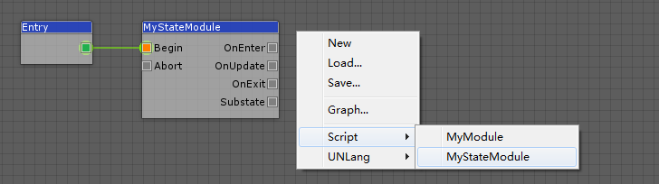

**UNLang 状态**是状态机的`状态`类型，因为状态机是一种处理游戏逻辑的通用方式。使用`状态`, 只要这个`状态`没有结束，使用者就可以实现循环逻辑。

当然，使用者可以通过重写`LangNode`来实现基础的`状态`，只是UNLang已经提供了一个内建的`状态`供使用者重定义。

## 状态

UNLang`状态`提供了一些默认的`LangSpot`。

|管脚|描述|
|--:|:--|
|`Begin`|`状态`入口。|
|`Abort`|强制`状态`退出。|
|`OnEnter`|`状态`初始化触发器。|
|`OnUpdate`|`状态`帧循环触发器。|
|`OnExit`|`状态`终止触发器。|
|`Substate`|`状态`的子状态.|

## 如何使用状态

有两种方式使用UNLang状态。

> 让我们用`状态`实现每一帧打印一次`Hello UNLang!`。

### 使用状态触发其他模块

直接使用UNLang`状态`来驱动其他逻辑。


使用`OnUpdate`输出管脚来触发UNLang节点章节创建的`MyModule`模块，因为`OnUpdate`会被每一帧触发一次。

### 扩展状态

实现`MyStateModule`来做同样的事情。

```csharp
using UNLang;
using UNode;

[NodeInterface("MyStateModule", "Script/")]
public sealed class MyStateModule : State
{
    protected override void OnExecute(LangInstance instance)
    {
        UnityEngine.Debug.Log("Hello UNLang!");
    }
}
```

重写`OnExecute`保护方法打印常量字符串。



### 区别

这两种方式的最大区别是是否这段逻辑能在UNLang中控制。如果使用者希望在UNLang中控制，那么将逻辑以模块方式输出，再通过内建的基础模块进行组合；或者在模块内实现所有逻辑，而只是用UNLang来触发。

如何使用主要取决于逻辑的复杂度和可重用性，这全都由使用者决定。
